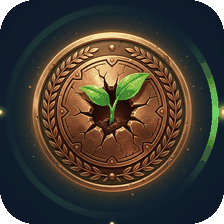

# 🏅 Arena Badge System — Concept & Ideas

> A badge system for [arena.ai](https://arena.ai) — the home of AI battles, blind
> side-by-side voting, and the public leaderboard. Badges celebrate **voting
> rituals, model instincts, prompt craft, and community spirit** — and give
> profiles a tiny shelf of shiny achievements.

---

## 1. Design Principles

1. **Battle-shaped** — every badge maps to something a user actually does on Arena:
   vote, predict, guess the model, write a killer prompt, or help the community.
2. **Three layers of gameplay** — *rookie habits* (easy, first-week), *skill*
   (harder, earned by being good at the game), *legend* (long-term loyalty).
3. **Tiered by material** — Bronze → Silver → Gold → **Prismatic** (rarest).
   The frame, not the icon, signals rarity, so icons can stay playful.
4. **Animated by default** — badges "come alive" with a shine sweep, an aura
   ring, and orbiting sparkles. Earned badges animate; unearned ones sit static
   and grayed out ("locked" silhouette) in the badge case.
5. **Evolvable streaks** — streak badges **evolve** (Ember → Flame → Inferno)
   instead of stacking duplicates. One slot, escalating art.
6. **Hidden badges** — mix in a few secret ones with "???" placeholders so
   there's always something to discover.

### Visual system
- **Tile:** dark rounded-square card (app-icon style), glossy medal center.
- **Tier frame:** Bronze rim `#c6875a` · Silver `#c9d4e3` · Gold `#e8b64c` ·
  Prismatic = rainbow shimmer.
- **Animation layer:** soft rotating aura ring + orbiting light dots + periodic
  diagonal shine sweep (all exported as looping GIFs, ~1s loops, transparent
  rounded corners, 256×256).
- **Accent colors per badge family:** green (growth), orange (streak), gold
  (milestones), violet (model skill), rainbow (prediction), platinum (elite),
  teal (early adopter).

---

## 2. Launch Set (7 badges — visuals included, see `gif/`)

| # | Badge | Slug | Tier | Unlock condition | Accent |
|---|-------|------|------|------------------|--------|
| 1 | 🌱 First Vote | `first-vote` | Bronze | Cast your very first battle vote | Green sprout |
| 2 | 🔥 On Fire | `streak-fire` | Bronze → Gold | Vote 7 (🔥), 30 (🔥🔥), 100 (🔥🔥🔥) days in a row — **evolves** | Flame |
| 3 | ⭐ Centurion | `vote-milestone` | Gold | 100 total votes (one star per 100) | Gold star + laurel |
| 4 | 🔮 Model Whisperer | `model-whisperer` | Silver | Guess the model correctly 10 times in anonymous battles | Violet lens |
| 5 | 👁️ The Oracle | `oracle` | Prismatic | Make 50 correct "which model is this?" predictions — the ultimate leaderboard instinct | Rainbow |
| 6 | 👑 Arena Elite | `arena-elite` | Gold | 1,000 lifetime votes | Platinum crown |
| 7 | 🚀 Founding Voter | `founding-voter` | Prismatic | Registered & voted in the first 30 days (limited edition) | Teal comet |

---

## 3. More Ideas (organized by journey)

### 🗳️ Voting & Activity
- **Tiebreaker** — vote "Tie" 10 times. ☯️
- **The Referee** — vote "Both bad" 25 times (you're holding the line on quality).
- **Night Owl** — vote between 1–5 AM. 🦉
- **Speedrunner** — cast a vote within 3 seconds of the battle loading. ⚡
- **Marathoner** — vote 500 times in a single week. 🏃
- **Century Club / 5K** — 100 / 5,000 lifetime votes (star pips per 100).
- **Decider** — be the vote that pushed a model to #1 in a category. 🏆
- **Curator** — vote in 10 different categories (text, image, code, agent…). 🗂️

### 🎯 Skill & Prediction
- **Cold Read** — correctly guess a model from style alone (no cheating). 🕵️
- **Nostradamus** — 10 correct predictions in a row. 🔮
- **Bar Setter** — your prediction moves the leaderboard ranking of a model. 📈
- **Hidden Gem** — be the first to vote for a model that later enters the top 10. 💎
- **Double Blind** — identify the **identical** model in two different codenames. 🎭

### ✍️ Prompt Craft
- **Prompt Alchemist** — your prompt gets featured in the community gallery. 🧪
- **Muse** — your prompt is used by 100+ other users. 🎨
- **Topic Master** — win "best prompt" in a community challenge. 🏅
- **Agent Wrangler** — get an agent model to complete a multi-step task flawlessly. 🤖

### 🤝 Community
- **Scout** — first to vote on a newly released model's debut battle. 🧭
- **Mentor** — help 25 users via badges/guide replies. 🧑‍🏫
- **Guardian** — report 10 spam or abusive battles (verified). 🛡️
- **Globetrotter** — vote battles in 10+ languages (i18n hero). 🌍

### 🕵️ Hidden / Secret (listed as "???")
- **The Twist** — vote "Tie" on two battles where the models are actually the same. 🤫
- **Early Bird** — vote in a category within its first day of existence. 🐦
- **Perfect Night** — cast bets on a day, and every model you picked wins. ✨

### 🎉 Limited / Seasonal
- **April Fool** — vote on April 1st. 🤡
- **Model-versary** — vote on the anniversary of your first vote. 🎂
- **Season Finisher** — complete every weekly battle challenge in a season. 🏁

---

## 4. Animation Specs (used in the exported GIFs)

| Effect | Look | Timing |
|--------|------|--------|
| Aura ring | Thin metallic ring circling the medal rim | 1 rotation / 1.0 s loop |
| Orbit sparkles | 2–3 glowing dots orbiting the ring | 1 orbit / 1.0 s, offset phases |
| Shine sweep | Diagonal light band sweeping across the face | 2 passes / 1.0 s loop |
| Earned vs locked | Earned = full color + animation; Locked = grayscale, static, dimmed | — |

---

## 5. Files

```
badges/
├── BADGE_IDEAS.md     ← this document
├── README.md          ← how to use / embed
├── showcase.html      ← live gallery of all badges
├── src/               ← original AI-generated 1024×1024 artwork
├── png/               ← static 512×512 badge art (product-ready)
├── gif/               ← animated 256×256 looping badges (the goods)
└── build_badges.py    ← regenerates gif/ + png/ from src/
```

**Embed (HTML):**
```html

```

---

## 6. Next Steps Ideas
- [ ] Add badge-card design for the **profile page** (trophy shelf + progress
      bars toward next badge).
- [ ] Build a **"badge earned 🎉"** share-card generator (badge + name + date).
- [ ] Add **seasonal badge passes** and event-only drops to drive retention.
- [ ] A/B test lock→earn animation as a **dopamine moment** on vote completion.
