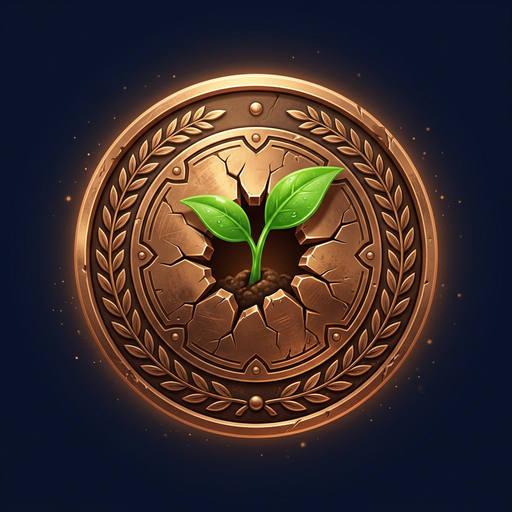

# 🏅 Arena Badges — Launch Set

Animated achievement badges for [arena.ai](https://arena.ai), generated from
AI artwork with a programmatic animation layer (aurora ring, orbit sparkles,
shine sweep, glow pulse).

## What's inside

```
badges/
├── BADGE_IDEAS.md      ← full badge-system concept + 40+ more badge ideas
├── README.md           ← this file
├── showcase.html       ← live gallery (open in a browser)
├── src/                ← original 1024×1024 artwork
├── png/                ← static 512×512 badge art
├── gif/                ← animated 224×224 GIFs (~0.9s seamless loop)
└── build_badges.py     ← regenerates gif/ + png/ from src/
```

## The launch set

| Badge | File | Tier | Unlock |
|-------|------|------|--------|
| 🌱 First Vote | `gif/first-vote.gif` | Bronze | Cast your very first battle vote |
| 🔥 On Fire | `gif/streak-fire.gif` | Bronze → Gold | Vote 7 / 30 / 100 days in a row (evolves) |
| ⭐ Centurion | `gif/vote-milestone.gif` | Gold | 100 lifetime votes |
| 🔮 Model Whisperer | `gif/model-whisperer.gif` | Silver | 10 correct model guesses |
| 👁️ The Oracle | `gif/oracle.gif` | Prismatic | 50 correct model predictions |
| 👑 Arena Elite | `gif/arena-elite.gif` | Gold | 1,000 lifetime votes |
| 🚀 Founding Voter | `gif/founding-voter.gif` | Prismatic | Voted in the first 30 days (limited) |

## Embedding

```html
<!-- animated, 224×224, transparent rounded corners -->


<!-- static, product-ready 512×512 -->

```

## Regenerating

Requires Python 3 + Pillow + numpy (a `.venv` at the repo root works).

```bash
python3 -m venv .venv && .venv/bin/pip install pillow numpy
.venv/bin/python badges/build_badges.py
```

Artwork lives in `badges/src/<slug>.png` (1024×1024 named per slug).
Animations are tuned for small GIFs: 16 frames, shared palette (no dither),
narrow single shine pass, glow masked to the outer annulus so the medal face
stays static between frames (keeps files ~200–260 KB).

## Design notes

- **Earned vs locked:** earned badges animate; locked ones render grayscale
  and static in the badge case.
- **Tier = frame material** (bronze/silver/gold/prismatic), icon stays playful.
- **Streaks evolve** in place (Ember → Flame → Inferno) instead of stacking.
- Full concept, more ideas, and animation specs: [`BADGE_IDEAS.md`](./BADGE_IDEAS.md).
